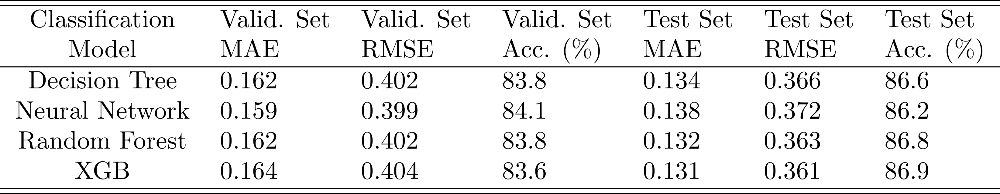
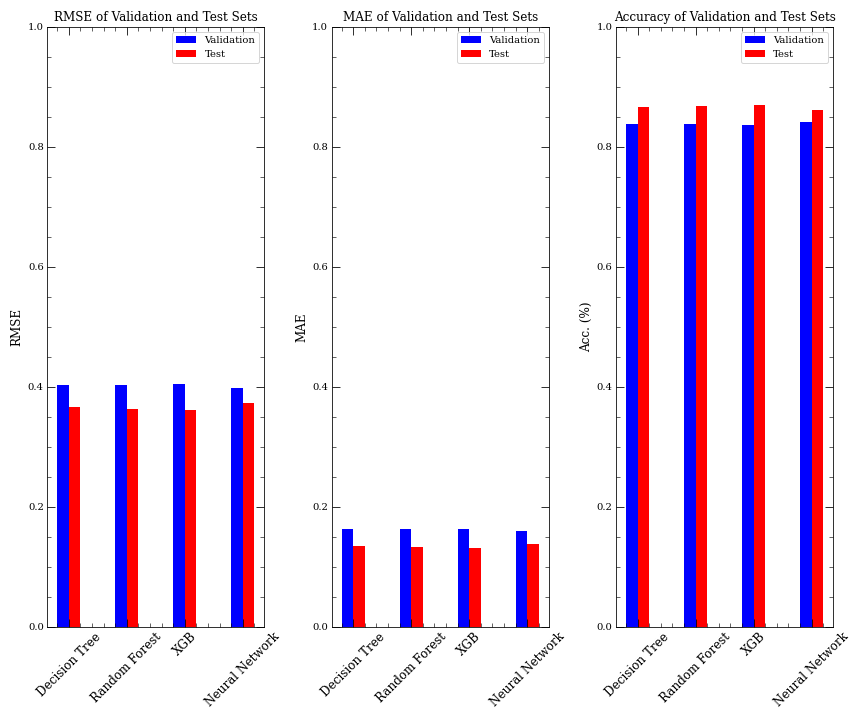
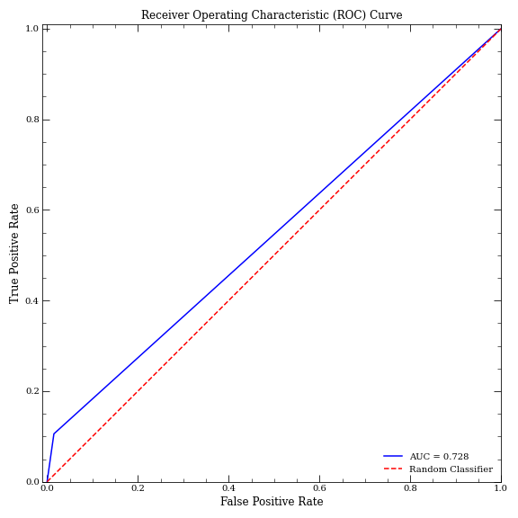

# Heart_Disease_Classification
Provided in this repositiory is a classification model for patients that could develop cardiovascular disease (CVD), found from the Kaggle dataset: https://www.kaggle.com/code/akashsikarwar/heart-disease-prediction-logistic-regression. We utilized various algorithms, which includes Decision Trees, Random Forests, eXtreme Gradient Boosting (XGB), and a Multi-Layered Perceptron Classifier (Neural Network).

Among these models, the Neural Network exhibited superior performance of the accuracy metric of the validation dataset. To optimize its performance, Grid Searching was employed to fine-tune the model's hyperparameters. The following optimal hyperparameters were identified:
* activation = tanh,
* alpha = 0.01,
* max_iter = 3000,
* and hidden_layer_sizes = (256, 128, 64, 32, 16, 8, 4, 2).

Below is the Receiver Operating Characteristic (ROC) curve depicting the Neural Network's classification performance. 

Please note that this example is not intended for medical use.
